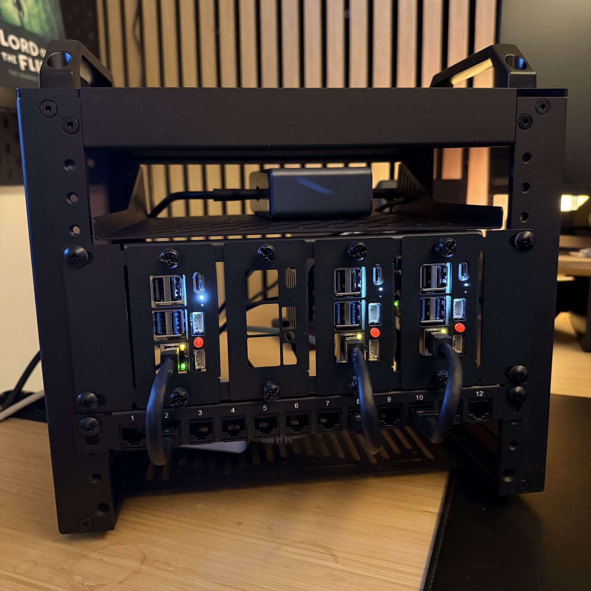

# Pascal's Homelab

👋 Hi there!

Finally got time to write about my homelab setup. It's not *that* special, but ... it's mine.

Here it is, ... isn't it beautiful?

## Hardware

* [3x Raspberry Pi 5 (8Gb)](https://www.kiwi-electronics.com/nl/raspberry-pi-5-8gb-11580)
* [GeeekPi DeskPi T0 4U](https://shorturl.at/935yF)
* [GeeekPi 10 inch 2U Rack Mount for 4x Raspberry Pi 5](https://shorturl.at/K6cVp)
* [GeeekPi 12 Port Patch Panel 0.5U CAT6](https://shorturl.at/rE2g1)
* [Crucial P310 500GB NVMe SSD](https://www.alternate.nl/Crucial/P310-500-GB-SSD/html/product/100079258)
* [Unifi USW Flex Mini](https://www.coolblue.nl/product/888938/ubiquiti-unifi-usw-flex-mini.html)
* [Anker Prime Charger 200W](https://www.coolblue.nl/product/963285/anker-prime-6-in-1-oplaadstation-200w.html)

## Getting Started

Start [here](docs/README.md) to understand the architecture, then follow the guides in order.

### Core — Get your cluster running

1. [Raspberry Pi](docs/core/01-RASPBERRYPI.md) — Hardware setup, OS install, and network config
2. [k3s](docs/core/02-K3S.md) — Lightweight Kubernetes cluster

### Base — Make the cluster production-ready

3. [MetalLB](docs/base/01-METALLB.md) — Bare-metal LoadBalancer
4. [Traefik](docs/base/02-TRAEFIK.md) — Ingress controller
5. [cert-manager](docs/base/03-CERT-MANAGER.md) — TLS certificates via DNS-01
6. [external-dns](docs/base/04-EXTERNAL-DNS.md) — Automatic DNS records
7. [Traefik TLS](docs/base/05-TRAEFIK-TLS.md) — Default wildcard TLS certificate
8. [Argo CD](docs/base/06-ARGOCD.md) — GitOps continuous delivery
9. [Sealed Secrets](docs/base/07-SEALED-SECRETS.md) — Encrypted secrets in Git

### Workloads — Deploy services on the platform

10. [Monitoring](docs/workloads/01-MONITORING.md) — Prometheus, Grafana, and Alertmanager
11. [Renovate](docs/workloads/02-RENOVATE.md) — Automated dependency updates
